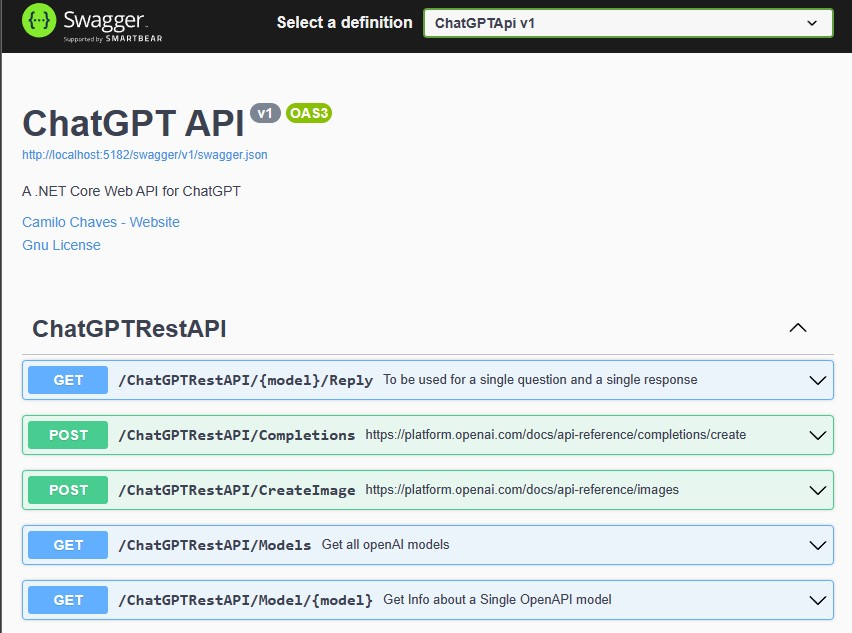

# ChatGPT Api

1. Instructions:  
Create a file **appsettings.development.json** if you are running this locally
```
{
  "Logging": {
    "LogLevel": {
      "Default": "Information",
      "Microsoft.AspNetCore": "Warning"
    }
  },
  "AllowedHosts": "*",
  "OpenAIKey":"WRITE HERE YOUR OPEN AKI KEY"
}
```

run on **WSL**
```
sudo service docker start
bash start.sh
```

navigate to: http://localhost:5182/swagger


Check SignalR folder for instruction of how to call SignalR endpoint from Angular!